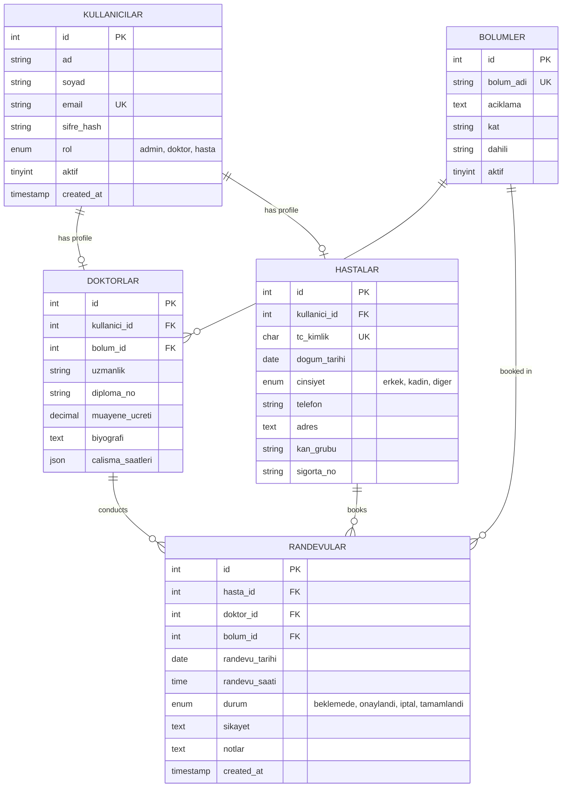

# 🏥 Hospital Information Management System (HBYS - Hastane Bilgi Yönetim Sistemi)

A modern, web-based enterprise solution designed to streamline hospital operations, including patient onboarding, doctor scheduling, department management, appointment bookings, and clinical reporting.

Built with a **Vite + React** frontend styled with **Bootstrap 5**, a secure **Node.js/Express** backend, and a relational **MySQL** database.

---

## 🚀 Key Highlights & Tech Stack

This project was engineered to demonstrate full-stack capabilities, secure API design, complex relational database modeling, and clean responsive UI development.

- **Frontend:** React (Vite), React Router DOM (v6), Context API (Global Auth & Theme), Axios, Chart.js / Recharts.
- **Backend:** Node.js, Express.js (RESTful API architecture), CORS.
- **Security:** JSON Web Tokens (JWT) for authentication, bcryptjs for password hashing, Role-Based Access Control (RBAC) middleware.
- **Database:** MySQL (relational structure, custom indexes, and advanced analytical queries).
- **Styling:** Bootstrap 5 (fully responsive layouts with dynamic dark/light theme options).

---

## 👥 Multi-Role User Portals & Workflows

The application implements a secure, role-based access system. Depending on the login credentials, users are routed to one of three portals:

### 👑 1. Admin Portal
- **Dashboard Analytics:** Visual representation of monthly appointment counts (Bar Chart) and department distributions (Pie Chart).
- **User & Role Management:** Full CRUD operations for creating, updating, and disabling Doctor and Patient accounts.
- **Department Administration:** Create and modify hospital clinics, departments, floor assignments, and extensions.
- **Advanced Reports:** Access to advanced database queries summarizing hospital revenue, active patients, and doctor workload.

### 👨‍⚕️ 2. Doctor Portal
- **Appointment Scheduling:** View incoming bookings, approve pending visits, or cancel/reschedule.
- **Patient Electronic Health Records (EHR):** Search and access patient files, previous diagnoses, and appointment history.
- **Clinical Documentation:** Input medical notes, prescription comments, and update appointment completion status.

### 🩸 3. Patient Portal
- **Profile & Health Info:** Manage personal contact details, address, and view registered critical health data (e.g., Blood Group, Insurance No).
- **Appointment Booking Wizard:** Seamless step-by-step form to select departments, view available doctors, choose vacant slots, and submit complaints.
- **Personal History:** Track past appointments, pending requests, and download clinical notes.

---

## 📊 Database Architecture

The system uses a highly normalized MySQL schema containing 5 core tables. Relationships are enforced via cascading foreign keys to maintain data integrity.

### Entity-Relationship Diagram (ERD)



---

## ⚡ Advanced SQL Analytics (Portfolio Highlight)

To optimize load times and run complex hospital operations, the database utilizes advanced querying techniques including Windows Functions, Subqueries, aggregations, and existential checks:

### 1. Department Performance & Capacity Utilization
Calculates total appointments, approvals, cancellations, and the completion success rate per clinic.
```sql
SELECT
    b.bolum_adi,
    COUNT(r.id) AS toplam_randevu,
    SUM(CASE WHEN r.durum = 'tamamlandi' THEN 1 ELSE 0 END) AS tamamlanan,
    SUM(CASE WHEN r.durum = 'iptal' THEN 1 ELSE 0 END) AS iptal_edilen,
    SUM(CASE WHEN r.durum = 'beklemede' THEN 1 ELSE 0 END) AS beklemede,
    ROUND(
        SUM(CASE WHEN r.durum = 'tamamlandi' THEN 1 ELSE 0 END)
        / COUNT(r.id) * 100, 2
    ) AS tamamlanma_yuzdesi
FROM bolumler b
LEFT JOIN randevular r ON b.id = r.bolum_id
GROUP BY b.id, b.bolum_adi
ORDER BY toplam_randevu DESC;
```

### 2. Doctor Monthly Workload & Revenue Allocation
Employs the `OVER(PARTITION BY...)` window function to compare a doctor's monthly patient visits and financial earnings with the overall average monthly load.
```sql
SELECT
    d.id AS doktor_id,
    CONCAT(k.ad, ' ', k.soyad) AS doktor_adi,
    b.bolum_adi,
    DATE_FORMAT(r.randevu_tarihi, '%Y-%m') AS ay,
    COUNT(r.id) AS randevu_sayisi,
    SUM(d.muayene_ucreti) AS toplam_gelir,
    ROUND(AVG(COUNT(r.id)) OVER (
        PARTITION BY DATE_FORMAT(r.randevu_tarihi, '%Y-%m')
    ), 1) AS ay_ortalamasi
FROM doktorlar d
JOIN kullanicilar k ON d.kullanici_id = k.id
JOIN bolumler b ON d.bolum_id = b.id
LEFT JOIN randevular r ON d.id = r.doktor_id AND r.durum = 'tamamlandi'
WHERE r.randevu_tarihi >= DATE_SUB(CURDATE(), INTERVAL 6 MONTH)
GROUP BY d.id, k.ad, k.soyad, b.bolum_adi, ay
ORDER BY ay DESC, toplam_gelir DESC;
```

### 3. Patient Engagement Analytics
Uses subqueries and `HAVING` filters to isolate the most active patients in the last 3 months and determine their most frequented doctor.
```sql
SELECT
    h.id AS hasta_id,
    CONCAT(k.ad, ' ', k.soyad) AS hasta_adi,
    h.kan_grubu,
    COUNT(r.id) AS toplam_randevu,
    (
        SELECT CONCAT(k2.ad, ' ', k2.soyad)
        FROM randevular r2
        JOIN doktorlar d2 ON r2.doktor_id = d2.id
        JOIN kullanicilar k2 ON d2.kullanici_id = k2.id
        WHERE r2.hasta_id = h.id
        GROUP BY r2.doktor_id
        ORDER BY COUNT(*) DESC
        LIMIT 1
    ) AS en_cok_gidilen_doktor
FROM hastalar h
JOIN kullanicilar k ON h.kullanici_id = k.id
JOIN randevular r ON h.id = r.hasta_id
WHERE r.randevu_tarihi >= DATE_SUB(CURDATE(), INTERVAL 3 MONTH)
GROUP BY h.id, k.ad, k.soyad, h.kan_grubu
HAVING COUNT(r.id) >= 2
ORDER BY toplam_randevu DESC
LIMIT 20;
```

### 4. Dynamic Time-Slot Availability Check
Uses a `NOT EXISTS` query to dynamically filter out doctors who are already booked at a specific date and hour to prevent double booking.
```sql
SELECT
    d.id AS doktor_id,
    CONCAT(k.ad, ' ', k.soyad) AS doktor_adi,
    b.bolum_adi,
    d.muayene_ucreti,
    (
        SELECT COUNT(*)
        FROM randevular r2
        WHERE r2.doktor_id = d.id AND r2.randevu_tarihi = '2025-06-15' AND r2.durum != 'iptal'
    ) AS bugunun_randevu_sayisi,
    (
        SELECT COUNT(*)
        FROM randevular r3
        WHERE r3.doktor_id = d.id AND r3.durum = 'tamamlandi'
    ) AS toplam_tamamlanan
FROM doktorlar d
JOIN kullanicilar k ON d.kullanici_id = k.id
JOIN bolumler b ON d.bolum_id = b.id
WHERE k.aktif = 1
AND NOT EXISTS (
    SELECT 1 FROM randevular r
    WHERE r.doktor_id = d.id
      AND r.randevu_tarihi = '2025-06-15'
      AND r.randevu_saati = '10:00:00'
      AND r.durum != 'iptal'
)
ORDER BY b.bolum_adi, d.muayene_ucreti;
```

---

## 🛠️ Installation & Setup Guide

Ensure you have [Node.js](https://nodejs.org/) (v18+) and [MySQL Server](https://www.mysql.com/) installed locally.

### 1. Database Setup
1. Open your MySQL client and create a database:
   ```sql
   CREATE DATABASE hbys_db;
   ```
2. Import the schema script located at `backend/database/schema.sql`:
   ```bash
   mysql -u root -p hbys_db < backend/database/schema.sql
   ```

### 2. Backend Setup
1. Navigate to the backend directory:
   ```bash
   cd backend
   ```
2. Install dependencies:
   ```bash
   npm install
   ```
3. Create a `.env` file in the `backend/` root:
   ```env
   DB_HOST=localhost
   DB_USER=your_mysql_username
   DB_PASSWORD=your_mysql_password
   DB_NAME=hbys_db
   JWT_SECRET=super_secure_random_string_here
   PORT=5000
   ```
4. Start the server:
   ```bash
   npm start
   ```
   *(Or run `node server.js` / `nodemon server.js` if configured)*

### 3. Frontend Setup
1. Navigate to the frontend directory:
   ```bash
   cd ../frontend
   ```
2. Install dependencies:
   ```bash
   npm install
   ```
3. Run the Vite development server:
   ```bash
   npm run dev
   ```
4. Access the web app at [http://localhost:5173](http://localhost:5173) in your browser.

---

## 📂 Project Architecture

```
hbys/
├── backend/                  # RESTful API (Node.js & Express)
│   ├── config/               # DB connection configuration
│   ├── controllers/          # API logical handlers (Auth, CRUD, SQL queries)
│   ├── database/             # schema.sql and seed data
│   ├── middleware/           # Auth and RBAC middleware
│   ├── models/               # SQL queries and model functions
│   ├── routes/               # API route definitions
│   └── server.js             # Main server entrypoint
│
└── frontend/                 # Client UI (Vite, React, Bootstrap)
    ├── src/
    │   ├── api/              # Axios wrappers for backend calls
    │   ├── components/       # UI Components
    │   │   ├── layout/       # Navbar, Sidebar, Footer
    │   │   ├── common/       # Tables, Modals, Spinners, Badges, Search
    │   │   ├── forms/        # Input forms for patients, doctors, departments
    │   │   └── charts/       # Data visualization charts
    │   ├── context/          # Global Contexts (Auth, Theme)
    │   ├── hooks/            # Custom Hooks (useAuth, useFetch)
    │   ├── pages/            # View Pages (Login, Dashboard, Profil, etc.)
    │   ├── routes/           # Routing configuration (AppRouter, PrivateRoute)
    │   └── utils/            # Helper scripts (validators, date formatting)
    └── index.html
```

---

## 🛡️ Security & Performance Best Practices Implemented

- **Password Safety:** Uses `bcryptjs` for one-way salting and hashing. Plaintext passwords are never stored.
- **REST Protection:** Custom route guards and middleware ensure users can only perform operations relevant to their role.
- **Global Authentication & State:** Utilizes React Context API combined with localStorage JWT tokens to persist session states and auto-inject headers in Axios requests.
- **Responsive Layout:** Engineered with fluid Bootstrap grids to support seamless viewing on mobile, tablet, and desktop monitors.
